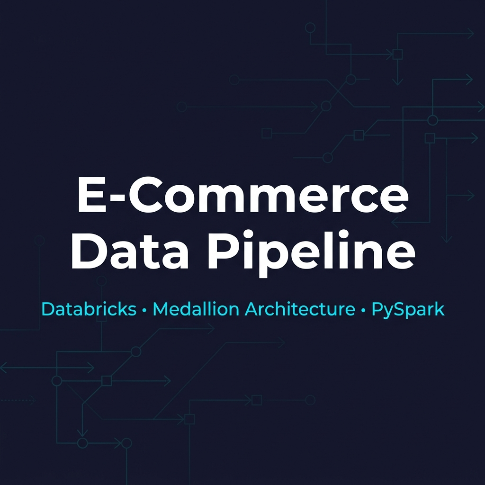
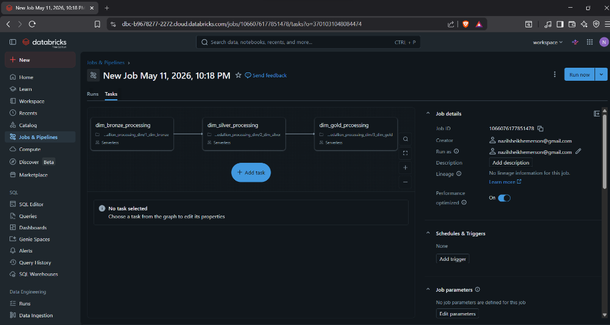

<p align="center">
  
</p>

<h1 align="center">🛒 E-Commerce Data Pipeline on Databricks</h1>

<p align="center">
  <b>End-to-end data engineering project implementing the Medallion Architecture (Bronze → Silver → Gold) for an e-commerce platform using Databricks, PySpark, Delta Lake, and Unity Catalog.</b>
</p>

<p align="center">
  
  
  
  
  
</p>

---

## 📑 Table of Contents

- [Overview](#-overview)
- [Architecture](#-architecture)
- [Tech Stack](#-tech-stack)
- [Data Sources](#-data-sources)
- [Medallion Architecture](#-medallion-architecture-bronze--silver--gold)
- [Data Quality & Transformations](#-data-quality--transformations)
- [Databricks Jobs & Pipeline Orchestration](#-databricks-jobs--pipeline-orchestration)
- [Project Structure](#-project-structure)
- [Key Business Questions](#-key-business-questions-genie-ai)
- [Getting Started](#-getting-started)
- [Author](#-author)

---

## 📌 Overview

This project simulates a **real-world e-commerce data platform** where raw transactional and dimensional data flows through a multi-layered lakehouse pipeline on **Databricks**. The pipeline ingests messy, real-world-like CSV data (with intentional anomalies), cleanses and transforms it across three layers, and produces **BI-ready analytical tables** for dashboards and business intelligence.

### Key Highlights

- 🏗️ **Medallion Architecture** — Bronze (raw), Silver (cleansed), Gold (aggregated/BI-ready)
- 🔄 **ETL Pipeline** — Fully automated with Databricks Jobs running on Serverless compute
- 📊 **300K+ customers**, **50K+ products**, **183K+ order transactions** across 92 days
- 💱 **Multi-currency support** — 7 currencies (INR, USD, GBP, AUD, SGD, AED, CAD) with INR conversion
- 🧹 **Data Quality Handling** — Duplicates, type mismatches, special characters, null handling
- 🏛️ **Unity Catalog** — Centralized governance with `ecommerce` catalog and `bronze/silver/gold` schemas
- 📈 **Denormalized View** — Ready for Power BI / Tableau dashboards

---

## 🏛️ Architecture

### Databricks Lakehouse Architecture (Implemented)

<p align="center">
  
</p>

> The Databricks Lakehouse consolidates ETL processing, data warehousing, and data serving into a single unified platform — eliminating the need for separate ETL tools and a standalone data warehouse.

### Legacy Architecture (For Comparison)

<p align="center">
  
</p>

> The legacy approach required multiple AWS services (Lambda, Glue, EC2) for ETL and Redshift for warehousing — resulting in higher complexity and operational overhead.

---

## 🛠️ Tech Stack

| Technology | Purpose |
|:---|:---|
| **Databricks** | Unified analytics platform (compute, storage, orchestration) |
| **Apache Spark (PySpark)** | Distributed data processing engine |
| **Delta Lake** | ACID-compliant storage layer on the lakehouse |
| **Unity Catalog** | Data governance, access control, lineage tracking |
| **Databricks Jobs** | Pipeline orchestration with task dependencies |
| **Serverless Compute** | Auto-scaling, zero-management compute clusters |
| **SQL** | Gold layer transformations and denormalized views |
| **Python** | Core programming language for all ETL notebooks |
| **AWS S3** | Underlying cloud storage for the lakehouse |

---

## 📦 Data Sources

The raw data resides in Databricks **Volumes** and consists of 6 datasets:

| # | Dataset | Format | Volume | Key Columns |
|:---:|:---|:---:|:---:|:---|
| 1 | **Brands** | CSV | 52 records | `brand_code`, `brand_name`, `category_code` |
| 2 | **Categories** | CSV | 10 records (8 unique) | `category_code`, `category_name` |
| 3 | **Products** | CSV | 50,000 records | `product_id`, `sku`, `brand_code`, `color`, `size`, `material`, dimensions |
| 4 | **Customers** | CSV | 300,000 records | `customer_id`, `phone`, `country_code`, `country`, `state` |
| 5 | **Calendar/Date** | CSV | 95 records (92 unique) | `date`, `year`, `day_name`, `quarter`, `week_of_year` |
| 6 | **Order Items** | 92 daily CSVs | 183,378 records | `order_id`, `customer_id`, `product_id`, `quantity`, `unit_price`, `discount_pct`, `channel` |

---

## 🥉🥈🥇 Medallion Architecture (Bronze → Silver → Gold)

```
  ┌─────────────────┐     ┌─────────────────┐     ┌─────────────────┐
  │                 │     │                 │     │                 │
  │   🥉 BRONZE     │────▶│   🥈 SILVER     │────▶│   🥇 GOLD       │
  │   Raw Ingest    │     │   Cleansed      │     │   BI-Ready      │
  │                 │     │                 │     │                 │
  └─────────────────┘     └─────────────────┘     └─────────────────┘
   • Schema-on-read        • Type casting          • Business logic
   • Source metadata        • Deduplication         • Joins & enrichment
   • Append-only            • Standardization       • Calculated metrics
                            • Null handling          • Currency conversion
```

### 🥉 Bronze Layer — Raw Ingestion

Raw CSV files ingested as-is into Delta tables with added metadata columns (`_source_file`, `ingested_at`).

| Table | Source | Notebook |
|:---|:---|:---|
| `brz_brands` | `brands.csv` | `1_dim_bronze.ipynb` |
| `brz_category` | `category.csv` | `1_dim_bronze.ipynb` |
| `brz_products` | `products.csv` | `1_dim_bronze.ipynb` |
| `brz_customers` | `customers.csv` | `1_dim_bronze.ipynb` |
| `brz_calendar` | `date.csv` | `1_dim_bronze.ipynb` |
| `brz_order_items` | `order_items_*.csv` (92 files) | `1_fact_bronze.ipynb` |

### 🥈 Silver Layer — Cleansed & Standardized

Data quality issues resolved, types corrected, duplicates removed, and values standardized.

| Table | Key Transformations | Notebook |
|:---|:---|:---|
| `slv_brands` | Trim whitespace, remove special chars (`@`, `*`, `!`), fix category codes | `2_dim_silver.ipynb` |
| `slv_category` | Deduplicate, uppercase codes | `2_dim_silver.ipynb` |
| `slv_products` | Cast `weight_grams` (remove "g" suffix), fix comma decimals, handle negative ratings | `2_dim_silver.ipynb` |
| `slv_customers` | Standardize phone numbers, validate country codes | `2_dim_silver.ipynb` |
| `slv_calendar` | Parse dates, fix negative `week_of_year`, derive `month_name`, `is_weekend` | `2_dim_silver.ipynb` |
| `slv_order_items` | Cast all types, remove `%` from discounts, `"Two"` → `2`, standardize channels (`web` → `Website`, `app` → `Mobile`) | `2_fact_silver.ipynb` |

### 🥇 Gold Layer — Business-Ready

Enriched, joined, and aggregated tables ready for BI tools and dashboards.

| Table | Description | Notebook |
|:---|:---|:---|
| `gld_dim_products` | Products joined with brands and categories (enriched dimension) | `3_dim_gold.ipynb` |
| `gld_dim_date` | Enriched calendar with `month_name`, `is_weekend`, `date_id` | `3_dim_gold.ipynb` |
| `gld_dim_customers` | Customer dimension table | `3_dim_gold.ipynb` |
| `gld_fact_order_items` | Fact table with `gross_amount`, `discount_amount`, `sale_amount`, `sale_amount_inr`, `coupon_flag`, `date_id` | `3_fact_gold.ipynb` |
| `fact_transactions_denorm` | Denormalized view joining fact + date + products for direct BI consumption | SQL View |

---

## 🧹 Data Quality & Transformations

The raw data contains **intentional real-world anomalies** that are handled across the pipeline:

<details>
<summary><b>Click to expand — Full list of data quality issues handled</b></summary>

### Brands
| Issue | Example | Fix |
|:---|:---|:---|
| Leading/trailing whitespace | `"  NovaWave "` | `F.trim()` |
| Special characters in codes | `VOLT@`, `GLOW*`, `QLHS!` | `regexp_replace(r'[^A-Za-z0-9]', '')` |
| Inconsistent category codes | `GROCERY`, `BOOKS`, `TOYS` | Mapped to standard codes (`GRCY`, `BKS`, `TOY`) |

### Categories
| Issue | Example | Fix |
|:---|:---|:---|
| Duplicate rows | `app` × 2, `grcy` × 2 | `dropDuplicates(['category_code'])` |
| Lowercase codes | `ce`, `app`, `hnk` | `F.upper()` |

### Products
| Issue | Example | Fix |
|:---|:---|:---|
| String numeric fields | `"305g"`, `"22,2"` | Regex clean + cast |
| Comma as decimal separator | `"22,2"` → `22.2` | `regexp_replace(',', '.')` |
| Typos in material | `"Coton"`, `"Ruber"` | Standardized in Silver |
| Negative rating_count | `-4` | Replaced with `0` |

### Calendar/Date
| Issue | Example | Fix |
|:---|:---|:---|
| Inconsistent case | `"friday"`, `"FRIDAY"`, `"Friday"` | `F.initcap()` |
| Negative week_of_year | `-31`, `-22` | `F.abs()` |
| Duplicate entries | 3 extra rows with conflicting data | `dropDuplicates(['date'])` |
| Missing month_name | Not in source | Derived using `F.date_format()` |

### Order Items (Fact)
| Issue | Example | Fix |
|:---|:---|:---|
| Text in numeric field | `quantity = "Two"` | `F.when("Two", 2)` + cast |
| `%` suffix in discount | `"16%"` | `regexp_replace('%', '')` + cast |
| Multiple currencies | INR, USD, GBP, AUD, SGD, AED, CAD | Converted to INR using fixed FX rates |
| Channel inconsistency | `"web"`, `"app"` | Standardized to `"Website"`, `"Mobile"` |
| Mixed case coupon codes | `"FEST20"`, `"fest20"` | `F.lower(F.trim())` |

</details>

### 💱 Currency Conversion (FX Rates)

All monetary values are converted to **INR** in the Gold layer using fixed rates:

| Currency | INR Rate |
|:---:|:---:|
| INR | 1.00 |
| AED | 24.18 |
| AUD | 57.55 |
| CAD | 62.93 |
| GBP | 117.98 |
| SGD | 68.18 |
| USD | 88.29 |

---

## ⚙️ Databricks Jobs & Pipeline Orchestration

The ETL pipeline is orchestrated using **Databricks Jobs** with task dependencies, ensuring notebooks execute in the correct order. All tasks run on **Serverless compute** for cost efficiency and zero-management overhead.

### Dimension Processing Pipeline

<p align="center">
  
</p>

The dimension pipeline job consists of **3 sequential tasks**:

```
dim_bronze_processing  →  dim_silver_processing  →  dim_gold_processing
      (Bronze)                  (Silver)                  (Gold)
```

| Task | Notebook | Compute | Description |
|:---|:---|:---:|:---|
| `dim_bronze_processing` | `1_dim_bronze.ipynb` | Serverless | Ingest all dimension CSVs into Bronze Delta tables |
| `dim_silver_processing` | `2_dim_silver.ipynb` | Serverless | Cleanse, deduplicate, and standardize dimensions |
| `dim_gold_processing` | `3_dim_gold.ipynb` | Serverless | Join and enrich dimensions into BI-ready Gold tables |

### Fact Processing Pipeline

The fact pipeline follows the same pattern:

```
fact_bronze_processing  →  fact_silver_processing  →  fact_gold_processing
      (Bronze)                  (Silver)                  (Gold)
```

| Task | Notebook | Compute | Description |
|:---|:---|:---:|:---|
| `fact_bronze_processing` | `1_fact_bronze.ipynb` | Serverless | Ingest 92 daily order CSVs into Bronze |
| `fact_silver_processing` | `2_fact_silver.ipynb` | Serverless | Type casting, deduplication, channel standardization |
| `fact_gold_processing` | `3_fact_gold.ipynb` | Serverless | Calculate amounts, currency conversion, add business flags |

### Job Configuration

- **Compute**: Databricks Serverless (auto-scaling, pay-per-use)
- **Task Dependencies**: Sequential — each task waits for the previous to complete
- **Performance Optimized**: Enabled for faster execution
- **Scheduling**: Can be triggered manually or set with cron schedules

---

## 📁 Project Structure

```
project_assets/
│
├── 📂 0_data/                              # Raw source data
│   └── 📂 ecomm-raw-data/
│       ├── 📂 brands/
│       │   └── brands.csv                  # 52 brand records
│       ├── 📂 category/
│       │   └── category.csv                # 8 product categories
│       ├── 📂 customers/
│       │   └── customers.csv               # 300,000 customer records
│       ├── 📂 date/
│       │   └── date.csv                    # 92-day calendar (Aug–Oct 2025)
│       ├── 📂 order_items/
│       │   └── 📂 landing/
│       │       ├── order_items_2025-08-01.csv
│       │       ├── order_items_2025-08-02.csv
│       │       └── ... (92 daily files)    # 183,378 total transactions
│       └── 📂 products/
│           └── products.csv                # 50,000 product records
│
├── 📂 1_codes/                             # Databricks notebooks
│   └── 📂 project_ecommerce/
│       ├── 📂 1_setup/
│       │   └── setup_catalog.ipynb         # Create catalog & schemas
│       ├── 📂 2_medallion_processing_dim/
│       │   ├── 1_dim_bronze.ipynb          # Dimension → Bronze
│       │   ├── 2_dim_silver.ipynb          # Dimension → Silver
│       │   └── 3_dim_gold.ipynb            # Dimension → Gold
│       └── 📂 3_medallion_processing_fact/
│           ├── 1_fact_bronze.ipynb          # Fact → Bronze
│           ├── 2_fact_silver.ipynb          # Fact → Silver
│           └── 3_fact_gold.ipynb            # Fact → Gold
│
├── 📂 2_genie_exploration/
│   └── questions.txt                       # Business questions for Databricks Genie AI
│
├── 📂 3_dashboard/
│   └── denormalise_table_query.txt          # SQL for denormalized BI view
│
├── 📂 resources/
│   ├── databricks_architecture.png          # Architecture diagram
│   ├── legacy_architecture.png              # Legacy architecture comparison
│   └── 📂 screenshots/
│       └── dim_job_pipeline.png             # Databricks Jobs screenshot
│
└── README.md                                # This file
```

---

## ❓ Key Business Questions (Genie AI)

The Gold layer is designed to answer these analytical questions directly:

1. 💰 **How many transactions were made in USD currency?**
2. 📈 **What is the total revenue (in INR) and number of order lines by month for 2025?** — Monthly trend
3. 🏆 **Top 10 products by revenue (in INR) for August** — Including category and brand
4. 📅 **What was the biggest single revenue day?** — Which product segments drove it
5. 📱 **Average revenue per customer by channel (Website vs Mobile)** — Monthly breakdown
6. 🌍 **Distribution of customers by country**
7. 🗺️ **Average revenue per region**

---

## 🚀 Getting Started

### Prerequisites

- Databricks workspace (Community Edition or paid tier)
- Unity Catalog enabled
- Cluster with Spark 3.x+ / Serverless compute

### Setup Instructions

1. **Clone the repository**
   ```bash
   git clone https://github.com/<your-username>/DataBricks_Project.git
   ```

2. **Upload raw data to Databricks Volumes**
   ```
   Upload contents of 0_data/ecomm-raw-data/ to:
   /Volumes/ecommerce/source_data/raw/
   ```

3. **Run the setup notebook**
   ```
   Execute: 1_codes/project_ecommerce/1_setup/setup_catalog.ipynb
   → Creates the ecommerce catalog with bronze, silver, gold schemas
   ```

4. **Run the dimension pipeline (in order)**
   ```
   1. 2_medallion_processing_dim/1_dim_bronze.ipynb
   2. 2_medallion_processing_dim/2_dim_silver.ipynb
   3. 2_medallion_processing_dim/3_dim_gold.ipynb
   ```

5. **Run the fact pipeline (in order)**
   ```
   1. 3_medallion_processing_fact/1_fact_bronze.ipynb
   2. 3_medallion_processing_fact/2_fact_silver.ipynb
   3. 3_medallion_processing_fact/3_fact_gold.ipynb
   ```

6. **Create the denormalized view**
   ```sql
   -- Execute the SQL from 3_dashboard/denormalise_table_query.txt
   CREATE OR REPLACE VIEW ecommerce.gold.fact_transactions_denorm AS (
     SELECT i.*, c.year, c.month_name, c.day_name, c.is_weekend,
            c.quarter, c.week, p.sku, p.category_code, p.category_name,
            p.brand_code, p.brand_name, p.color, p.size, p.rating_count,
            EXTRACT(HOUR FROM transaction_ts) AS hour_of_day
     FROM ecommerce.gold.gld_fact_order_items i
     JOIN ecommerce.gold.gld_dim_date c ON i.date_id = c.date_id
     JOIN ecommerce.gold.gld_dim_products p ON i.product_id = p.product_id
   );
   ```

7. **Or simply create a Databricks Job** to automate steps 4–6 as shown in the [Pipeline Orchestration](#%EF%B8%8F-databricks-jobs--pipeline-orchestration) section!

---

## 🧰 Unity Catalog Structure

```
📦 ecommerce (Catalog)
├── 📂 bronze (Schema)
│   ├── brz_brands
│   ├── brz_category
│   ├── brz_products
│   ├── brz_customers
│   ├── brz_calendar
│   └── brz_order_items
├── 📂 silver (Schema)
│   ├── slv_brands
│   ├── slv_category
│   ├── slv_products
│   ├── slv_customers
│   ├── slv_calendar
│   └── slv_order_items
└── 📂 gold (Schema)
    ├── gld_dim_products
    ├── gld_dim_date
    ├── gld_dim_customers
    ├── gld_fact_order_items
    └── fact_transactions_denorm (VIEW)
```

---

## 👤 Author

**Nazil Sheikh**

- 📧 nazilsheikhemerson@gmail.com

---

<p align="center">
  <b>⭐ If you found this project helpful, please give it a star!</b>
</p>

<p align="center">
  <i>Built with ❤️ using Databricks, PySpark, and Delta Lake</i>
</p>
